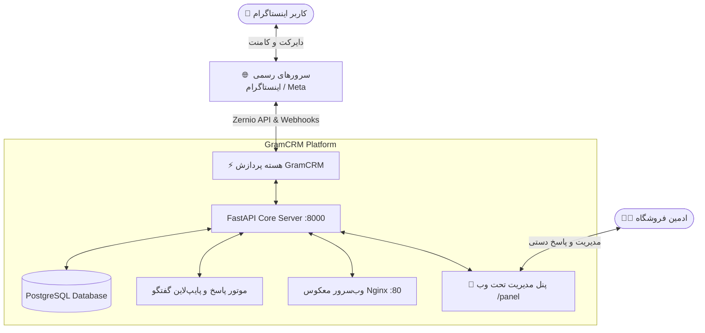

<div align="center">

# ⚡ GramCRM
### پلتفرم جامع اتوماسیون هوشمند دایرکت، کامنت و مدیریت فروش اینستاگرام
**A Modern, Enterprise-Grade Instagram Direct & Comment Sales Automation Platform & CRM**

<br>

[](https://fastapi.tiangolo.com)
[](https://www.python.org)
[](https://www.postgresql.org)
[](https://ubuntu.com)
[](https://zernio.com)
[](LICENSE)

<br>

[نصب سریع](#-نصب-سریع-روی-سرور-تکدستوری) • [قابلیت‌های تجاری](#-قابلیت‌های-تجاری-و-رقابتی) • [معماری](#-معماری-سیستم) • [مدیریت سرویس](#-دستورات-مدیریت-سرور) • [تنظیمات دامنه و ssl](#-اتصال-دامنه-و-ssl-رایگان)

</div>

---

## 🚀 نصب سریع روی سرور (تک‌دستوری)

تنها با کپی و پیست کردن دستور زیر در سرور ابری (Ubuntu 20.04 / 22.04 / 24.04)، کل پلتفرم به همراه دیتابیس PostgreSQL، وب‌سرور Nginx، فایروال و سرویس ۲۴ ساعته Systemd در کمتر از **۲ دقیقه** نصب و راه‌اندازی می‌شود:

```bash
bash <(curl -Ls https://raw.githubusercontent.com/MHTAHERII/GramCRM/main/deploy.sh)
```

> [!TIP]
> این اسکریپت تمام نیازمندی‌های سیستم‌عامل، پایتون، پورت‌ها و کانفیگ‌های امنیتی را به‌صورت کاملاً خودکار تنظیم کرده و در پایان، آدرس‌های دسترسی به پنل با دو پروتکل **IPv4** و **IPv6** را تحویل می‌دهد.

---

## 💎 قابلیت‌های تجاری و رقابتی

**GramCRM** برای کسب‌وکارهای آنلاین، شاپ‌های اینستاگرامی و آژانس‌های دیجیتال مارکتینگ طراحی شده است تا فروش و پشتیبانی را ۲۴ ساعته و بدون نیاز به ادمین انسانی مدیریت کند:

| قابلیت | GramCRM ⚡ | ربات‌های سنتی (Instagrapi / شبیه‌ساز) |
| :--- | :---: | :---: |
| **ریسک بن و بلاک شدن پیج** | **صفر (کاملاً رسمی و امن)** | بسیار بالا (شناسایی سریع توسط اینستاگرام) |
| **معماری دریافت پیام‌ها** | **وب‌هوک زنده (Real-Time Push)** | فقط لاگین مکرر و اسکرپ ناپایدار |
| **اتوماسیون کامنت به دایرکت** | ✅ بومی و آنی | ❌ نامتعادل و ناپایدار |
| **پنل مدیریت تحت وب** | ✅ الترا-مدرن (Linear/Dark Mode) | ❌ معمولاً بدون پنل یا بسیار ابتدایی |
| **دروازه فالو (Follow Gate)** | ✅ افزایش قطعی فالوور پیج | ❌ محدود |
| **استقرار روی سرور (VPS)** | ✅ تک‌دستوری و ۲۴/۷ خودکار | ❌ نیاز به کانفیگ دستی و طولانی |

---

## ✨ ویژگی‌های برجسته پلتفرم

### 🎯 ۱. موتور رشد و تبدیل فروش (Sales Engine)
* **اتوماسیون کامنت به دایرکت (Comment-to-DM):** ارسال خودکار دایرکت در کسری از ثانیه به محض درج کلیدواژه توسط کاربران در کامنت پست‌ها.
* **همگام‌سازی ابری زنده (Auto-Sync):** تغییرات کلیدواژه‌ها در پنل مدیریت در لحظه و در پس‌زمینه با سرورهای هوشمند همگام‌سازی می‌شود.
* **دروازه فالو هوشمند (Follow Gate):** مشتریان پیش از دریافت قیمت یا لینک خرید، ملزم به فالو کردن پیج می‌شوند تا نرخ جذب فالوور به حداکثر برسد.
* **پشتیبانی از زبان فارسی:** نرمال‌سازی حروف «ی/ک»، فاصله‌های مجازی و حذف خطاهای املایی مشتریان جهت پاسخ‌دهی دقیق.

### 💬 ۲. میز کار و صندوق دایرکت (Inbox CRM)
* **مشاهده لحظه‌ای گفتگوها:** لیست تمام مشتریان با تاریخچه پیام‌ها شبیه به پیام‌رسان‌های مدرن دسکتاپ.
* **ارسال پاسخ دستی (Manual Send):** امکان پاسخگویی مستقیم و اختصاصی اپراتور از داخل پنل مدیریت.
* **پنجره ۲۴ ساعته هوشمند:** مدیریت اتوماتیک سقف زمانی اینستاگرام بدون برخورد با خطاهای پلتفرم.

### 🛍️ ۳. مدیریت محصولات و انبارداری
* تعریف کاتالوگ محصولات با قیمت‌گذاری و ثبت تعداد موجودی در انبار.
* گزارش‌گیری و ذخیره‌سازی داده‌های مشتریان در پایگاه داده مستقل PostgreSQL.

### 🎨 ۴. رابط کاربری الترا-مدرن (Next-Gen Dark UI)
* طراحی شده با زبان طراحی مینیمال مدرن (مشابه Linear.app و Stripe).
* تایپوگرافی چشم‌نواز با فونت استاندارد **وزیرمتن (Vazirmatn)**.
* پشتیبانی ۱۰۰٪ ریسپانسیو و روان در موبایل، تبلت و دسکتاپ.
* احراز هویت امن با کوکی‌های رمزنگاری‌شده (Timing-Attack Protected).

---

## 🏗 معماری فنی سیستم



---

## ⚙️ نیازمندی‌های سخت‌افزاری سرور

| قطعه | حداقل مشخصات | مشخصات پیشنهادی (پروداکشن) |
| :--- | :--- | :--- |
| **سیستم‌عامل** | Ubuntu 20.04 LTS | **Ubuntu 22.04 / 24.04 LTS** |
| **پردازنده (CPU)** | ۱ هسته (Shared) | ۱ الی ۲ هسته اختصاصی |
| **حافظه رم (RAM)** | ۱ گیگابایت (+ Swap) | **۲ گیگابایت** |
| **فضای دیسک** | ۱۰ گیگابایت SSD | **۲۰ الی ۳۰ گیگابایت NVMe** |
| **موقعیت سرور** | ترجیحاً خارج (آلمان/هلند/فنلاند) | خارج از ایران (جهت اتصال بدون محدودیت) |

---

## 🛠 دستورات مدیریت سرور

پس از نصب، سرویس GramCRM به‌صورت خودکار در پس‌زمینه مدیریت می‌شود:

```bash
# بررسی وضعیت اجرای زنده ربات
systemctl status perfumebot

# ریستارت کردن سرویس
systemctl restart perfumebot

# مشاهده لاگ‌های زنده سیستم
journalctl -u perfumebot -f -n 50

# توقف موقت سرویس
systemctl stop perfumebot
```

---

## 🔒 اتصال دامنه و SSL رایگان (HTTPS)

برای راه‌اندازی دامنه اختصاصی و فعال‌سازی وب‌هوک رسمی با HTTPS:

۱. در پنل دامنه خود، یک رکورد **A** بسازید و آی‌پی سرور را وارد کنید (مثلاً `crm.yourdomain.com`).  
۲. در ترمینال سرور، دستور زیر را اجرا کنید تا گواهینامه معتبر Let's Encrypt روی Nginx فعال شود:

```bash
apt install -y certbot python3-certbot-nginx
certbot --nginx -d crm.yourdomain.com
```

آدرس وب‌هوک شما آماده ثبت در پلتفرم اینستاگرام خواهد بود:
```text
https://crm.yourdomain.com/webhook/zernio
```

---

## 💻 راه‌اندازی لوکال (برای توسعه‌دهندگان)

```bash
# ۱. کلون پروژه
git clone https://github.com/MHTAHERII/GramCRM.git
cd GramCRM

# ۲. ساخت محیط مجازی و نصب وابستگی‌ها
python -m venv venv
# Windows:
venv\Scripts\activate
# Linux/Mac:
source venv/bin/activate

pip install -r requirements.txt

# ۳. اجرای سرور توسعه
uvicorn app.main:app --reload
```

- **پنل مدیریت:** `http://127.0.0.1:8000/panel` (رمز عبور پیش‌فرض: `admin123`)
- **مستندات تعاملی Swagger:** `http://127.0.0.1:8000/docs`

---

## 📄 لایسنس و شرایط استفاده

پروژه تحت لایسنس [MIT](LICENSE) منتشر شده است. استفاده تجاری، توسعه و شخصی‌سازی آن برای فروشگاه‌های مختلف کاملاً آزاد است.

<div align="center">

**توسعه‌داده شده با ❤️ توسط [محمدحسین طاهری](https://github.com/MHTAHERII)**

</div>
