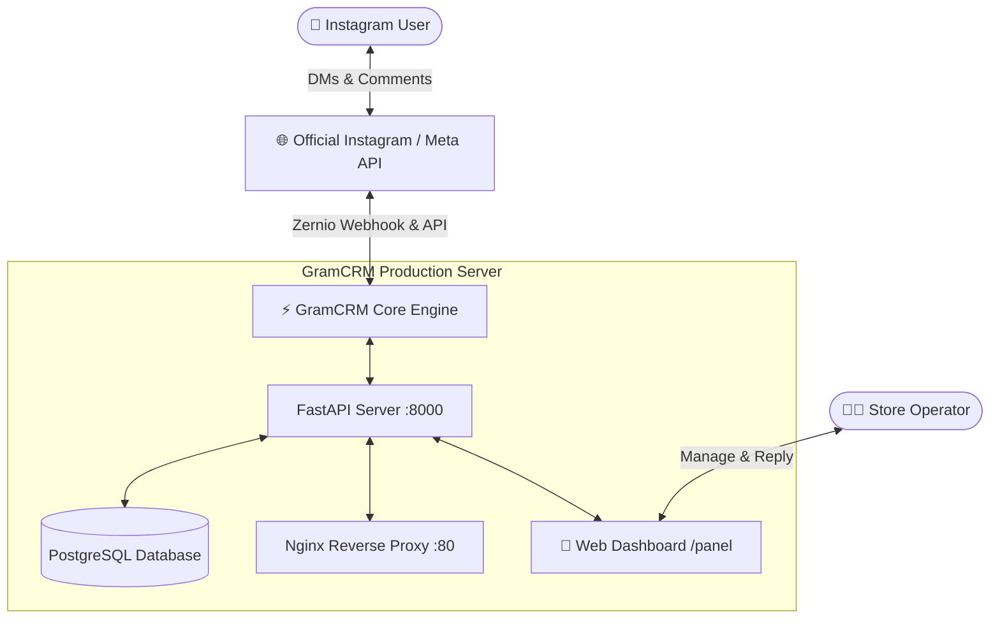

<div align="center">

# ⚡ GramCRM
### پلتفرم جامع اتوماسیون هوشمند دایرکت، کامنت و مدیریت فروش اینستاگرام
**A Modern, Enterprise-Grade Instagram Direct & Comment Sales Automation Platform & CRM**

<br>

[](https://fastapi.tiangolo.com)
[](https://www.python.org)
[](https://www.postgresql.org)
[](https://ubuntu.com)
[](https://zernio.com)
[](LICENSE)

<br>

**[ 🇺🇸 English ](#-english) &nbsp;|&nbsp; [ 🇮🇷 فارسی ](#-فارسی)**

</div>

---

<a name="-english"></a>
# 🇺🇸 English

### 💡 Overview
**GramCRM** is a next-generation social commerce and customer relationship management (CRM) platform designed specifically for Instagram businesses. Unlike traditional, fragile, and high-risk scraping bots, GramCRM operates on **Official Meta / Zernio Cloud APIs** with **sub-second real-time webhooks**, ensuring **zero account ban risk** and maximum enterprise reliability.

It features an ultra-modern, Linear/Stripe-inspired web dashboard for managing conversations, products, automated keywords, and business settings without requiring complex frontend frameworks.

---

### 🚀 One-Line Server Installation

Deploy GramCRM on any clean **Ubuntu 20.04 / 22.04 / 24.04** VPS in under 2 minutes:

```bash
bash <(curl -Ls https://raw.githubusercontent.com/MHTAHERII/GramCRM/main/deploy.sh)
```

> [!TIP]
> The automated installer handles system updates, Python venv, PostgreSQL database creation, Nginx reverse proxy configuration, firewall security, and systemd service setup out-of-the-box. At completion, both **IPv4** and **IPv6** access URLs are displayed.

---

### 💎 Commercial Comparison

| Feature | GramCRM ⚡ | Traditional / Scraping Bots |
| :--- | :---: | :---: |
| **Account Ban Risk** | **Zero (Official Cloud API)** | High (Pattern detected by Meta) |
| **Event Architecture** | **Real-Time Push Webhooks (<1s)** | Polling / Fragile sessions |
| **Comment-to-DM Engine** | ✅ Native & Instant | ❌ Fragile / Often fails |
| **Modern Web Dashboard** | ✅ Next-Gen Dark UI | ❌ Basic or Non-existent |
| **Follow Gate (Audience Growth)** | ✅ Built-in | ❌ None |
| **Production Server Deploy** | ✅ 1-Line Automated Script | ❌ Complex Manual Setup |

---

### ✨ Key Capabilities

* **🤖 Comment-to-DM Automation:** Trigger personalized direct messages instantly when prospective customers comment specific keywords on any post or reel.
* **🔄 Live Cloud Auto-Sync:** Add, edit, or remove trigger keywords from the web panel, and have them automatically synced in the background.
* **🔒 Follow-Gate Engine:** Encourage account growth by requesting non-followers to follow the page before receiving automated pricing or catalogs.
* **💬 Unified Chat Inbox (CRM):** Real-time customer overview, conversation history, and manual replies sent directly to Instagram from the web console.
* **🛍️ Product & Catalog Management:** Track stock levels, prices, and product details with PostgreSQL persistence.
* **🎨 Ultra-Modern UI:** Dark obsidian color scheme, subtle glassmorphism, responsive across desktop and mobile devices.

---

### 🏗 Architecture



---

### 🛠 Server CLI Commands

```bash
# Check service status
systemctl status perfumebot

# Restart application
systemctl restart perfumebot

# View live real-time logs
journalctl -u perfumebot -f -n 50

# Stop service
systemctl stop perfumebot
```

---

### 🔒 Custom Domain & Free SSL (Certbot)

Point your domain's **A Record** to your server IP, then run:

```bash
apt install -y certbot python3-certbot-nginx
certbot --nginx -d crm.yourdomain.com
```

Your secure webhook endpoint is immediately ready:
```text
https://crm.yourdomain.com/webhook/zernio
```

---

<br>
<br>

---

<a name="-فارسی"></a>
# 🇮🇷 فارسی

### 💡 معرفی پروژه
**GramCRM** یک پلتفرم نسل جدید برای اتوماسیون فروش، مدیریت مشتریان و پشتیبانی خودکار در اینستاگرام است. برخلاف ربات‌های سنتی و پرریسک، GramCRM با استفاده از **API رسمی متصل به زیرساخت ابری Zernio** و **وب‌هوک‌های بلادرنگ (Real-Time Webhooks)** کار می‌کند که **ریسک بن یا محدودیت اکانت را به صفر می‌رساند**.

این سیستم به همراه یک **داشبورد تحت وب الترا-مدرن (Linear/Stripe Style)** با فونت زیبای وزیرمتن ارائه می‌شود که امکان پاسخ‌گویی دستی، مدیریت محصولات، و تعریف کلیدواژه‌ها را در اختیارتان قرار می‌دهد.

---

### 🚀 نصب سریع روی سرور (تک‌دستوری)

روی سرور خام **Ubuntu 20.04 / 22.04 / 24.04** تنها با یک دستور زیر کل سیستم را در کمتر از ۲ دقیقه مستقر کنید:

```bash
bash <(curl -Ls https://raw.githubusercontent.com/MHTAHERII/GramCRM/main/deploy.sh)
```

> [!TIP]
> این اسکریپت تمام مراحل شامل نصب بسته‌ها، پایتون، ساخت پایگاه داده PostgreSQL، پیکربندی وب‌سرور Nginx، فایروال و ساخت سرویس ۲۴ ساعته Systemd را به‌صورت تمام‌خودکار انجام داده و در پایان آدرس پنل را با دو پروتکل **IPv4** و **IPv6** ارائه می‌دهد.

---

### 💎 مقایسه تجاری و مزیت‌های رقابتی

| قابلیت | GramCRM ⚡ | ربات‌های سنتی و غیررسمی |
| :--- | :---: | :---: |
| **ریسک بن شدن پیج** | **صفر (کاملاً رسمی و امن)** | بسیار بالا (شناسایی توسط الگوریتم‌های متا) |
| **معماری دریافت پیام‌ها** | **وب‌هوک زنده رویدادمحور (<1s)** | اسکرپینگ ناپایدار و لاگین‌های مکرر |
| **اتوماسیون کامنت به دایرکت** | ✅ بومی و آنی | ❌ ناپایدار و با تاخیر |
| **پنل مدیریت تحت وب** | ✅ الترا-مدرن با تم تیره لوکس | ❌ ابتدایی یا فاقد پنل |
| **دروازه جذب فالوور (Follow Gate)** | ✅ افزایش تضمینی فالوور | ❌ محدود |
| **راه‌اندازی سرور (VPS)** | ✅ تک‌دستوری و خودکار | ❌ نیازمند کانفیگ دستی پیچیده |

---

### ✨ قابلیت‌های اصلی

* **🤖 اتوماسیون کامنت به دایرکت (Comment-to-DM):** ارسال خودکار دایرکت در کسری از ثانیه به محض درج کلیدواژه زیر پست‌ها یا ریلزها.
* **🔄 همگام‌سازی ابری خودکار (Auto-Sync):** با ایجاد، ویرایش یا حذف کلیدواژه در پنل مدیریت، تغییرات بلافاصله با سرورهای اینستاگرام همگام می‌شود.
* **🔒 دروازه فالو هوشمند (Follow Gate):** مشتریان پیش از دریافت قیمت یا لینک کاتالوگ، به فالو کردن پیج هدایت می‌شوند تا رشد پیج تضمین شود.
* **💬 صندوق پیام‌های یکپارچه (Inbox CRM):** مشاهده زنده تاریخچه پیام‌های هر مشتری و امکان ارسال پاسخ مستقیم از پنل به دایرکت کاربر.
* **🛍️ انبارداری و ثبت محصولات:** کاتالوگ کالاها، قیمت‌گذاری و ثبت موجودی با دیتابیس پایدار PostgreSQL.
* **🎨 طراحی مدرن و واکنش‌گرا:** طراحی شده بر اساس استانداردهای روز با فونت فارسی وزیرمتن (Vazirmatn).

---

### ⚙️ نیازمندی‌های سخت‌افزاری سرور

| قطعه | حداقل مشخصات | مشخصات پیشنهادی (پروداکشن) |
| :--- | :--- | :--- |
| **سیستم‌عامل** | Ubuntu 20.04 LTS | **Ubuntu 22.04 / 24.04 LTS** |
| **پردازنده (CPU)** | ۱ هسته (Shared) | ۱ الی ۲ هسته اختصاصی |
| **حافظه رم (RAM)** | ۱ گیگابایت (+ Swap) | **۲ گیگابایت** |
| **فضای دیسک** | ۱۰ گیگابایت SSD | **۲۰ الی ۳۰ گیگابایت NVMe** |
| **موقعیت سرور** | ترجیحاً خارج (آلمان/هلند/فنلاند) | خارج از ایران (جهت اتصال بدون فیلترینگ) |

---

### 🛠 دستورات خط فرمان سرور

```bash
# بررسی وضعیت اجرای زنده سرویس
systemctl status perfumebot

# راه‌اندازی مجدد (Restart)
systemctl restart perfumebot

# مشاهده لاگ‌های زنده سیستم
journalctl -u perfumebot -f -n 50

# توقف موقت سرویس
systemctl stop perfumebot
```

---

### 🔒 اتصال دامنه و فعال‌سازی SSL رایگان

پس از ست کردن رکورد **A** دامنه به سمت آی‌پی سرور:

```bash
apt install -y certbot python3-certbot-nginx
certbot --nginx -d crm.yourdomain.com
```

آدرس وب‌هوک شما آماده اتصال در اینستاگرام است:
```text
https://crm.yourdomain.com/webhook/zernio
```

---

### 💻 اجرای لوکال (محیط توسعه)

```bash
git clone https://github.com/MHTAHERII/GramCRM.git
cd GramCRM

python -m venv venv
# Windows:
venv\Scripts\activate
# Linux/Mac:
source venv/bin/activate

pip install -r requirements.txt
uvicorn app.main:app --reload
```

- **پنل مدیریت:** `http://127.0.0.1:8000/panel` (رمز عبور: `admin123`)
- **مستندات سواگر:** `http://127.0.0.1:8000/docs`

---

## 📄 License

This project is licensed under the [MIT License](LICENSE).

<div align="center">

**Developed with ❤️ by [MH TAHERI](https://github.com/MHTAHERII)**

</div>
